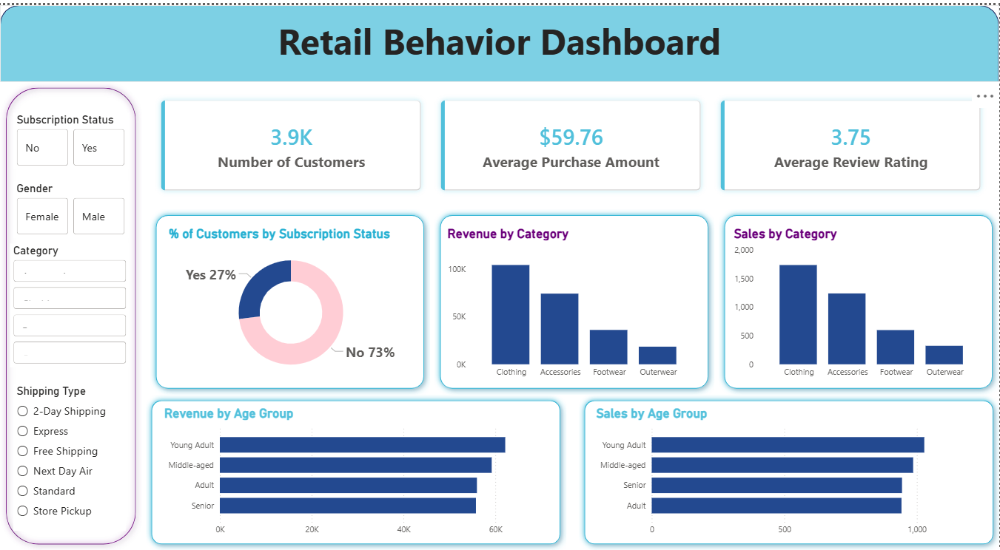

# 📊 Retail Customer Shopping Behavior & Trends Analysis

An end-to-end data analytics project designed to clean, analyze, and visualize retail customer transaction data. This project simulates an industry-standard workflow to translate raw transactional data into actionable business intelligence by combining **Python** (data wrangling & modeling), **SQL / PostgreSQL** (behavioral queries), and **Power BI** (interactive dashboard reporting).



---

## 📌 Project Overview
The objective of this project is to analyze a dataset of **3,900 customer records** to uncover patterns that drive purchasing decisions. It addresses key business challenges including demographic-based targeting, subscription program ROI, promotional discount efficiency, and customer loyalty retention.

The analysis is structured into three primary stages:
1. **Data Cleaning & Wrangling (Python)**: Imputed missing values using category medians, standardized schemas, engineered age demographic bins, and integrated the pipeline with a PostgreSQL database.
2. **Behavioral Analysis (SQL)**: Structured queries in PostgreSQL to analyze cohorts, customer purchase frequency, retention, and shipping choices.
3. **Business Intelligence Dashboard (Power BI)**: Built a dynamic dashboard featuring visual reports on revenue drivers, customer segments, and seasonal trends to support stakeholder decision-making.

---

## 📂 Repository Structure
The project is organized in a professional, modular layout:
```text
├── data/
│   └── customer_shopping_behavior.csv         # Raw transactional dataset
├── notebooks/
│   └── customer_trends_analysis.ipynb         # Python data cleaning & EDA notebook
├── sql/
│   └── customer_insights_queries.sql          # Structured PostgreSQL queries
├── dashboard/
│   └── retail_behavior_dashboard.pbix         # Power BI interactive report
├── reports/
│   ├── Business_Problem_Statement.pdf         # Official problem statement
│   ├── Customer_Behavior_Analysis_Report.pdf  # Project walkthrough document
│   └── retail_customer_trends_presentation.pptx # Stakeholder presentation deck
├── docs/
│   ├── business_problem.md                    # Problem statement in Markdown
│   └── analysis_walkthrough.md                # Project walkthrough in Markdown
├── LICENSE                                    # MIT License
└── README.md                                  # Project main documentation
```

---

## 🛠️ Tech Stack & Skills Demonstrated
* **Languages & Querying**: Python (pandas, SQLAlchemy, psycopg2), SQL (PostgreSQL)
* **Tools & Platforms**: Jupyter Notebooks, PostgreSQL PgAdmin, Power BI Desktop
* **Skills**: Data Cleaning & Imputation, Feature Engineering, Cohort Analysis, Database Loading, Relational Modeling, Interactive Dashboarding, Business Communication

---

## 🚀 How to Set Up and Run the Project

### 1. Data Cleaning & Database Injection
1. Clone this repository to your local system:
   ```bash
   git clone https://github.com/nisthajain/customer-trends-data-analysis-SQL-Python-PowerBI.git
   cd customer-trends-data-analysis-SQL-Python-PowerBI
   ```
2. Place the dataset `customer_shopping_behavior.csv` in the `/data` folder (pre-configured).
3. Open the Jupyter Notebook `notebooks/customer_trends_analysis.ipynb`.
4. Run all cells. The script will clean the data and automatically establish a PostgreSQL connection to inject the clean table into your local database. (Update database credentials in Cell 19 as required).

### 2. Run SQL Business Queries
1. Open your database tool (e.g., pgAdmin or psql) and connect to the database.
2. Open `/sql/customer_insights_queries.sql`.
3. Execute the queries sequentially to generate analytical insights on customer segments, revenue, and product preferences.

### 3. Open the Power BI Dashboard
1. Ensure you have Power BI Desktop installed.
2. Open `/dashboard/retail_behavior_dashboard.pbix` to explore the interactive visual analytics.
3. (Optional) Reconnect the data source settings to point to your local PostgreSQL table if you want to pull live database updates.

---

## 👤 About the Author
**Nistha Jain**  
Data Analyst with a passion for transforming raw customer data into actionable growth strategies. 

### 🚀 Let's Connect!
* **LinkedIn**: [Nistha Jain](https://www.linkedin.com/in/nistha-jain)
* **GitHub**: [nisthajain](https://github.com/nisthajain)
* **Email**: [nistha.jain@example.com](mailto:nistha.jain@example.com) *(Update with your professional email address)*

---

## 📜 License
This project is licensed under the MIT License - see the [LICENSE](LICENSE) file for details.
